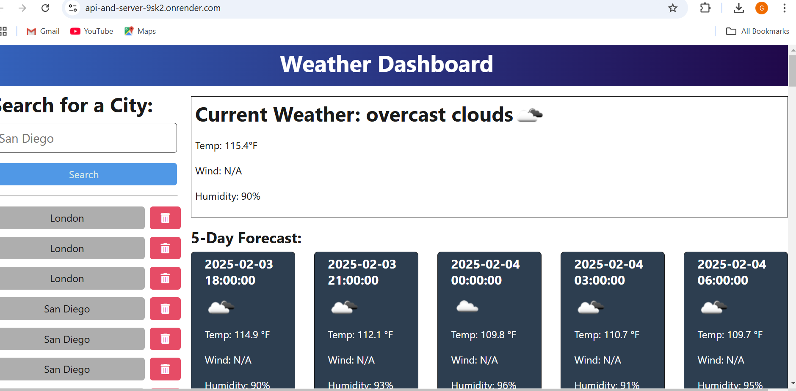
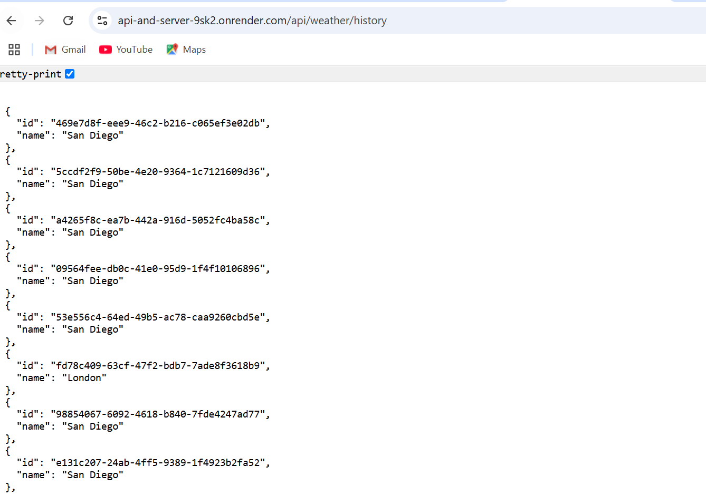

#  Weather Dashboard Application
##  Description
This project is a Weather Dashboard application that allows users to view the weather outlook for multiple cities. It retrieves weather data using the OpenWeather API and provides both current and future weather conditions. The application features a clean and intuitive user interface and is deployed to Render.

---

##  User Story

AS A traveler
I WANT to see the weather outlook for multiple cities  
SO THAT I can plan a trip accordingly  

---

##  Acceptance Criteria

- GIVEN a weather dashboard with form inputs:  
  - WHEN I search for a city:  
    - THEN I am presented with current and future conditions for that city, and that city is added to the search history.  
  - WHEN I view current weather conditions for that city:  
    - THEN I am presented with:  
      - City name  
      - Date  
      - An icon representation of weather conditions  
      - Description of the weather for the icon's alt tag  
      - Temperature  
      - Humidity  
      - Wind speed  
  - WHEN I view future weather conditions for that city:  
    - THEN I am presented with a 5-day forecast displaying:  
      - Date  
      - Weather icon  
      - Temperature  
      - Wind speed  
      - Humidity  
  - WHEN I click on a city in the search history:  
    - THEN I am again presented with current and future conditions for that city.

---

## Features

- Search for City Weather: Users can search for a city's weather and save it in the search history.  
- Current Weather Conditions: Displays city name, date, weather icon, description, temperature, humidity, and wind speed.  
- 5-Day Forecast: Provides weather details for the next five days, including date, weather icon, temperature, wind speed, and humidity.  
- Search History: Allows users to revisit weather data for previously searched cities.  
- Delete Functionality: Users can delete a city from the search history.

---

## API Integration

The application integrates with the OpenWeather API using the following endpoint:  

```
https://api.openweathermap.org/data/2.5/forecast?lat={lat}&lon={lon}&appid={API key}
```
---

## Back-End Functionality

- Uses a `searchHistory.json` file to store and retrieve cities.  
- Routes:  
  - GET /: Returns the `index.html` file.  
  - GET /api/weather/history: Reads and returns all saved cities from `searchHistory.json`.  
  - POST /api/weather: Saves a new city to `searchHistory.json` and returns weather data for the city.  
  - DELETE /api/weather/history/:id: Deletes a city from `searchHistory.json` using its unique ID.

---

## Deployment

The application is deployed to Render and can be accessed via the following link:  

## Screenshots

### Screenshot 1:


### Screenshot 2:



## Submission
#### endpoints 
  - GET: https://api-and-server-9sk2.onrender.com/
  - GET: https://api-and-server-9sk2.onrender.com/api/weather/history
  - POST: https://api-and-server-9sk2.onrender.com/api/weather/
  - DELETE: https://api-and-server-9sk2.onrender.com/api/weather/history/:id

## Github repo link
-Link: https://github.com/girma1978/API-And-Server

## Render link
-Link: https://api-and-server-9sk2.onrender.com/

